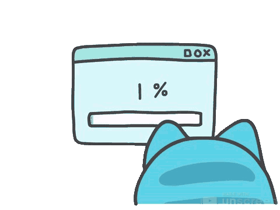

<!-- HEADER -->
  

<!-- PRESENTATION -->

  <samp>
    Yo soy 
    <a href="https://confley.vercel.app/"><strong>Confley</strong></a> desarrollador 
    <strong>full-stack</strong> apasionado por resolver problemas y no que los problemas me resuelvan a mi :v
  </samp>

  

<!-- CONTENT -->

### [Stack](https://skillicons.dev)

  <!-- Frontend -->
  
  
  
  

  <!-- Backend -->
  
  
   
  
  

  <!-- Databases -->
  
  
  

  <!-- Tools -->
  
   
  
  

  <!-- Platforms -->
  
  
  
  

 

<!-- SEE YA -->

  <samp> Me gusta trabajar en cosas <strong>innovadoras</strong>, si necesitas apoyo  con algo así no dudes en pedirme ayuda :D </samp>
    
  
  

 

<!-- FOOTER -->
  
