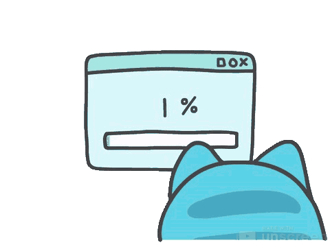

<!--
      ><(((º>   you opened the source. good. that's the whole idea.
                nothing here shouts. some of it waits.
-->

<!-- HEADER -->
  

<!-- PRESENTATION -->

  <samp>
    I'm <a href="https://confley.vercel.app/"><strong>Confley</strong></a>, a full-stack dev.
     
    I build chatbots, the systems behind them, and the agents that help me write both.
  </samp>

 

---

### Now

  <samp>
    WhatsApp bots and small CRMs that real companies run on. 
    Agent tooling — MCP servers, harnesses, skills — so my agents know my work as well as I do. 
    Trading indicators for MetaTrader, because a chart is a UI problem too.
  </samp>

 

---

### Stack

  <samp>core</samp>
   
  
  
  
  
  
  
  

    

  <samp>data</samp>
   
  
  
  
  

    

  <samp>agents &amp; ai</samp>
   
  
  
  
  

    

  <samp>ship &amp; watch</samp>
   
  
  
  
  
  

    

  <samp>charts</samp>
   
  
  

 

---

### What that looks like

  <samp>
    <strong>Bots that sell.</strong> WhatsApp assistants wired to the Meta API, a payment link, and a CRM 
    that remembers the customer. They answer at 3 a.m. and hand the lead over warm.
      
    <strong>The room behind the bots.</strong> Webhook routing, object storage, migrations with a 
    destination, dashboards that page me before the client calls.
      
    <strong>Tools for my agents.</strong> A harness I seed into every repo, MCP servers that expose 
    my own systems, and a memory my agents read before they touch anything.
  </samp>

 

<samp>><(((º></samp>

 

 
<samp>he has been here since 2024. he stays.</samp>

 

---

<!-- SEE YA -->

  <samp>
    I like work that has not been done yet. 
    If you are building one of those, come say hi.
  </samp>
    
  
  
    
  <samp><a href="https://confley.vercel.app/" target="_blank">·</a></samp>

 

<!-- FOOTER -->
  

<!--
  three fish swim through this page. you have met two.
-->
