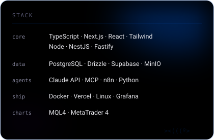

<!--
      ><(((º>   you opened the source. good. that's the whole idea.
                nothing here shouts. some of it waits.
-->

<!-- HEADER -->
  

<!-- PRESENTATION -->

  <samp>
    I'm <a href="https://confley.vercel.app/"><strong>Confley</strong></a>, a full-stack dev.
    I build chatbots, the systems behind them, and the agents that help me write both.
  </samp>

 

---

<!-- NOW + STACK -->

### Now

<samp>
WhatsApp bots and small CRMs that real companies run on.
  
Agent tooling — MCP servers, harnesses, skills — so my agents know my work as well as I do.
  
Trading indicators for MetaTrader, because a chart is a UI problem too.
</samp>

 

🐈‍⬛

 

 
<samp>he has been here since 2024. he stays.</samp>

---

### What that looks like

<samp>
Bots that answer at 3 a.m. and hand the lead over warm.
  
The room behind them — webhook routing, object storage, migrations with a destination, dashboards that page me before the client calls.
  
Tools for my agents: a harness I seed into every repo, and a memory they read before touching anything.
</samp>

 

---

<!-- SEE YA -->

  <samp>
    I like work that has not been done yet. 
    If you are building one of those, come say hi.
  </samp>
    
  
  &nbsp;&nbsp;&nbsp;&nbsp;&nbsp;
  
    
  

<!-- FOOTER -->
  

<!--
  three fish swim through this page. two of them are hiding.
-->
